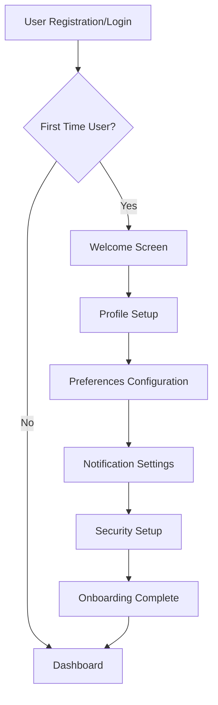

# User Onboarding Guide

## Overview

This document outlines the comprehensive user onboarding process for the Global Payroll System, including initial setup, security configuration, and user experience optimization.

## Table of Contents

1. [Onboarding Flow Overview](#onboarding-flow-overview)
2. [Super Administrator Setup](#super-administrator-setup)
3. [Regular User Onboarding](#regular-user-onboarding)
4. [Security Setup Wizard](#security-setup-wizard)
5. [Accessibility Features](#accessibility-features)
6. [Troubleshooting](#troubleshooting)

## Onboarding Flow Overview

### User Journey Map



### Onboarding Components

1. **WelcomeStep**: Introduction and system overview
2. **ProfileStep**: Personal information collection
3. **PreferencesStep**: User preferences and settings
4. **NotificationsStep**: Communication preferences
5. **SecurityStep**: Security configuration
6. **CompleteStep**: Final confirmation and next steps

## Super Administrator Setup

### Initial Configuration

The super administrator account is pre-configured with the following details:

```javascript
{
  username: "Nalungu Kevin",
  email: "nalungukevin@gmail.com",
  role: "Super Administrator",
  status: "Active",
  created: "2024-01-01T00:00:00Z",
  lastLogin: null
}
```

### Setup Process

#### Step 1: Password Change
- **Requirement**: Force password change on first login
- **Validation**: Strong password policy enforcement
- **Security**: Real-time strength meter and validation

```typescript
const PASSWORD_REQUIREMENTS = {
  minLength: 8,
  requireUppercase: true,
  requireLowercase: true,
  requireNumbers: true,
  requireSpecialChars: true,
  preventCommonPasswords: true,
  complexityScore: 60
};
```

#### Step 2: Security Questions
- **Count**: 3 required security questions
- **Options**: Pre-defined question bank
- **Purpose**: Account recovery and additional verification

```typescript
const SECURITY_QUESTIONS = [
  "What was the name of your first pet?",
  "What was the name of the street you grew up on?",
  "What was your mother's maiden name?",
  "What was the name of your first school?",
  "What was your childhood nickname?",
  "What was the make of your first car?",
  "What was the name of your first teacher?",
  "What was your favorite book as a child?",
  "What was the name of your first employer?",
  "What was your favorite movie as a teenager?"
];
```

#### Step 3: Terms & Conditions
- **Acceptance**: Required for system access
- **Content**: Legal terms and privacy policy
- **Tracking**: Audit log of acceptance

#### Step 4: System Configuration
- **Organization Setup**: Company details and settings
- **User Management**: Initial user creation
- **Security Policies**: System-wide security configuration

### Security Recommendations

During super admin setup, the system provides security recommendations:

1. **Enable MFA**: Strongly recommended for admin accounts
2. **Regular Password Updates**: 90-day rotation policy
3. **Session Management**: Monitor active sessions
4. **Audit Logging**: Regular security review

## Regular User Onboarding

### Onboarding Wizard

The onboarding wizard guides new users through a 6-step process:

#### Step 1: Welcome
- **Purpose**: System introduction and overview
- **Duration**: 2-3 minutes
- **Content**: 
  - System capabilities overview
  - Security features highlight
  - User benefits explanation

#### Step 2: Profile Setup
- **Required Fields**: First name, last name
- **Optional Fields**: Phone, department, position
- **Validation**: Real-time field validation
- **Accessibility**: Screen reader compatible

```typescript
interface ProfileData {
  firstName: string;
  lastName: string;
  phone?: string;
  department?: string;
  position?: string;
}
```

#### Step 3: Preferences
- **Language**: English, Spanish, French, German
- **Timezone**: Automatic detection with manual override
- **Date Format**: MM/DD/YYYY, DD/MM/YYYY, YYYY-MM-DD
- **Currency**: USD, EUR, GBP, CAD

#### Step 4: Notifications
- **Channels**: Email, SMS, Push notifications
- **Types**: Security alerts, payroll updates, reports
- **Granularity**: Per-notification-type control

#### Step 5: Security (Optional)
- **MFA Setup**: TOTP, SMS, Email options
- **Security Questions**: Account recovery setup
- **Backup Codes**: Emergency access codes

#### Step 6: Completion
- **Summary**: Configuration overview
- **Next Steps**: Dashboard access and training
- **Support**: Help resources and contact information

### User Experience Features

#### Progress Tracking
- **Visual Progress Bar**: Real-time completion status
- **Step Indicators**: Clear current position
- **Skip Options**: Optional steps can be skipped
- **Save Progress**: Resume later functionality

#### Accessibility
- **Screen Reader Support**: Full ARIA compliance
- **Keyboard Navigation**: Tab order and focus management
- **High Contrast**: WCAG 2.1 AA compliance
- **Reduced Motion**: Respects user preferences

#### Responsive Design
- **Mobile Optimized**: Touch-friendly interface
- **Tablet Support**: Optimized for medium screens
- **Desktop**: Full-featured experience

## Security Setup Wizard

### MFA Configuration

#### TOTP Setup
1. **QR Code Generation**: Secure secret sharing
2. **Manual Entry**: Alternative setup method
3. **Verification**: Test code validation
4. **Backup Codes**: Emergency access

#### SMS Setup
1. **Phone Number**: International format support
2. **Verification**: Test SMS delivery
3. **Rate Limiting**: 3 attempts per 5 minutes
4. **Fallback**: Alternative methods available

#### Email Setup
1. **Email Verification**: Test email delivery
2. **Template Customization**: Branded email templates
3. **Rate Limiting**: 3 attempts per hour
4. **Security**: Encrypted email content

### Security Recommendations

The system provides contextual security recommendations:

```typescript
const SECURITY_RECOMMENDATIONS = {
  admin: [
    "Enable MFA for additional security",
    "Set up security questions for account recovery",
    "Review and update password regularly",
    "Monitor active sessions regularly"
  ],
  employee: [
    "Consider enabling MFA for sensitive data access",
    "Set up security questions for account recovery",
    "Use a strong, unique password",
    "Keep your contact information updated"
  ]
};
```

### Grace Period Implementation

For admin roles, MFA setup includes a 7-day grace period:

- **Initial Access**: Full functionality available
- **Reminders**: Daily notifications to complete setup
- **Restrictions**: Sensitive operations require MFA after grace period
- **Extension**: Can be extended with proper justification

## Accessibility Features

### WCAG 2.1 AA Compliance

#### Visual Design
- **Color Contrast**: 4.5:1 minimum ratio
- **Text Scaling**: Up to 200% without horizontal scrolling
- **Focus Indicators**: Clear visual focus
- **High Contrast Mode**: Enhanced visibility option

#### Keyboard Navigation
- **Tab Order**: Logical navigation sequence
- **Skip Links**: Quick access to main content
- **Keyboard Shortcuts**: Common actions accessible
- **Focus Management**: Proper focus handling

#### Screen Reader Support
- **ARIA Labels**: Descriptive element labels
- **Live Regions**: Dynamic content announcements
- **Landmark Roles**: Page structure navigation
- **Form Labels**: Proper form field association

### Implementation

```typescript
// Accessibility service integration
import { accessibilityService } from '@/lib/accessibility';

// Screen reader announcements
accessibilityService.announce('Login successful', 'polite');

// Focus management
accessibilityService.focusMainContent();

// Keyboard navigation
accessibilityService.setupKeyboardNavigation();
```

### User Preferences

Users can customize accessibility settings:

- **Font Size**: Small, Medium, Large, Extra Large
- **High Contrast**: Toggle high contrast mode
- **Reduced Motion**: Respect motion preferences
- **Screen Reader**: Optimize for screen readers

## Troubleshooting

### Common Issues

#### Login Problems
1. **Forgot Password**: Use password reset flow
2. **Account Locked**: Contact administrator
3. **MFA Issues**: Use backup codes or contact support

#### Onboarding Issues
1. **Profile Setup**: Required fields validation
2. **Preferences**: Default values provided
3. **Security Setup**: Optional with recommendations

#### Technical Issues
1. **Browser Compatibility**: Modern browser required
2. **JavaScript Disabled**: Progressive enhancement
3. **Network Issues**: Offline capability

### Support Resources

#### Self-Service
- **Help Documentation**: Comprehensive guides
- **Video Tutorials**: Step-by-step walkthroughs
- **FAQ Section**: Common questions and answers
- **Troubleshooting Guide**: Problem resolution steps

#### Direct Support
- **Email Support**: support@company.com
- **Phone Support**: +1-800-SUPPORT
- **Live Chat**: Available during business hours
- **Ticket System**: Track support requests

### Error Handling

#### User-Friendly Messages
```typescript
const ERROR_MESSAGES = {
  network: 'Unable to connect. Please check your internet connection.',
  validation: 'Please correct the highlighted fields.',
  server: 'Something went wrong. Please try again.',
  permission: 'You don\'t have permission to perform this action.'
};
```

#### Recovery Actions
- **Retry Options**: Automatic and manual retry
- **Alternative Flows**: Backup procedures
- **Contact Support**: Direct escalation path
- **Progress Saving**: Resume where left off

## Best Practices

### User Experience
1. **Progressive Disclosure**: Show information gradually
2. **Clear Instructions**: Step-by-step guidance
3. **Visual Feedback**: Progress indicators and confirmations
4. **Error Prevention**: Validation and helpful hints

### Security
1. **Least Privilege**: Minimum required permissions
2. **Defense in Depth**: Multiple security layers
3. **Regular Updates**: Keep security measures current
4. **User Education**: Security awareness training

### Accessibility
1. **Inclusive Design**: Accessible to all users
2. **Testing**: Regular accessibility audits
3. **User Feedback**: Incorporate user suggestions
4. **Standards Compliance**: Follow WCAG guidelines

## Metrics and Analytics

### Onboarding Success Metrics
- **Completion Rate**: Percentage of users completing onboarding
- **Time to Complete**: Average onboarding duration
- **Drop-off Points**: Where users abandon the process
- **User Satisfaction**: Post-onboarding feedback

### Security Metrics
- **MFA Adoption**: Percentage of users with MFA enabled
- **Security Score**: Overall security posture
- **Compliance Rate**: Adherence to security policies
- **Incident Rate**: Security-related issues

### Performance Metrics
- **Page Load Time**: Onboarding page performance
- **Error Rate**: Technical issues during onboarding
- **Support Tickets**: Onboarding-related support requests
- **User Feedback**: Qualitative feedback analysis

## Conclusion

The user onboarding process is designed to provide a smooth, secure, and accessible experience for all users. Regular updates and improvements ensure the process remains effective and user-friendly.

For questions or feedback regarding the onboarding process, contact the user experience team at ux@company.com.
